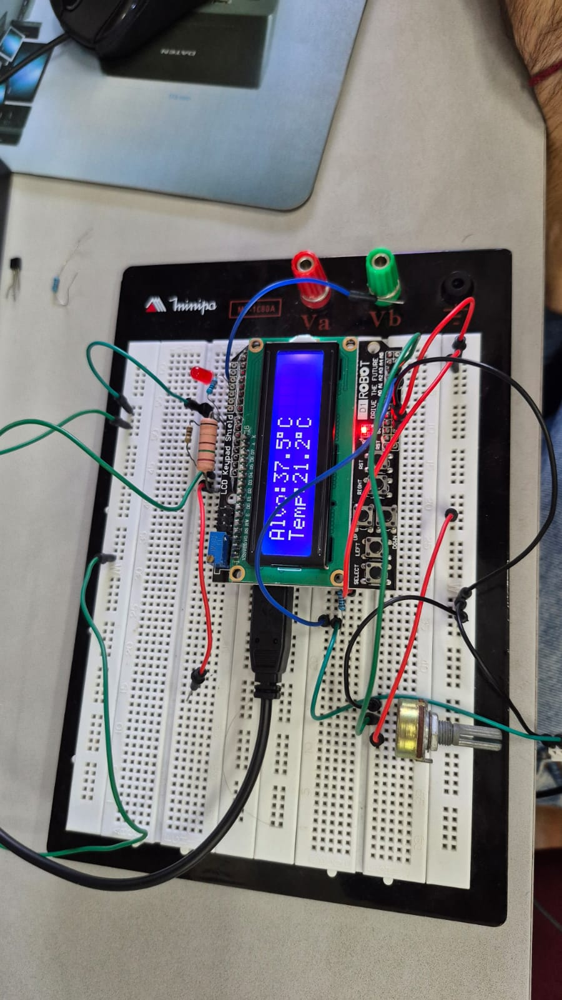
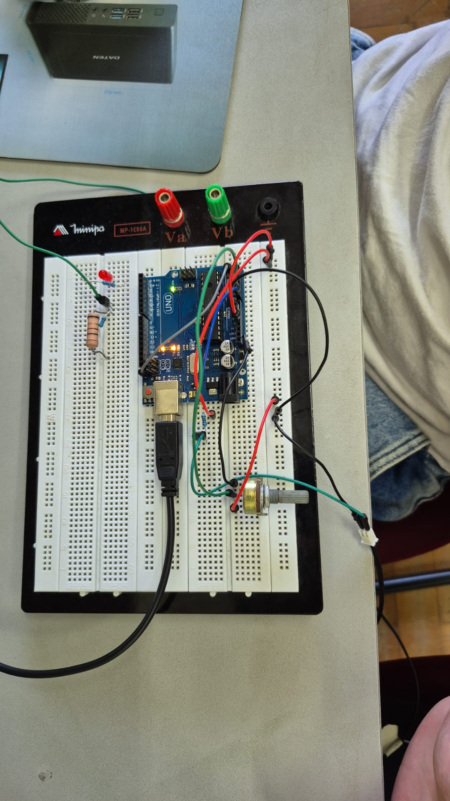

# 🌡️ Neonatal Incubator Temperature Monitor

An embedded systems project that monitors and controls the internal temperature of a neonatal incubator using a **NTC thermistor**, **proportional control (P)**, and a **16x2 LCD display**. Designed with patient safety in mind — the system immediately cuts heating and triggers an alarm if temperature reaches a critical threshold.

---

## 📋 Overview

The system continuously reads temperature from an NTC MF58 thermistor and compares it against a user-defined set point adjusted via a potentiometer. A proportional controller calculates the appropriate PWM output to drive a resistive heating load, maintaining the incubator at the desired temperature. A safety alarm (LED) activates and heating is immediately disabled when temperature reaches 38°C.

## Main circuit

<div align="center">


<div/>

---

## ✨ Features

- 🌡️ Real-time temperature measurement via NTC thermistor (Steinhart-Hart β equation)
- 🎛️ Adjustable set point (20°C – 38°C) via potentiometer
- ⚙️ Proportional controller (P) for smooth PWM-based heating control
- 🖥️ 16x2 LCD display showing current temperature and set point
- 🚨 Safety alarm — LED activates and heating cuts off at ≥ 38°C
- 📊 Serial Monitor output for real-time debugging (10Hz loop)

---

## 🛠️ Hardware

| Component | Description |
|---|---|
| Arduino (Uno/Nano) | Main microcontroller |
| NTC MF58 Thermistor | Temperature sensor (10kΩ @ 25°C, β = 3950) |
| 10kΩ Resistor | Voltage divider for NTC reading |
| Potentiometer | Set point adjustment (20°C – 38°C) |
| Resistive Load | Heating element controlled via PWM |
| LCD 16x2 | Temperature and set point display |
| LED | Safety alarm indicator |

---

## 📌 Pin Configuration

| Pin | Function |
|---|---|
| A0 | NTC thermistor (analog read) |
| A1 | Potentiometer set point (analog read) |
| D3 | PWM output → heating load |
| D2 | Alarm LED |
| D4–D9 | LCD 16x2 (4-bit mode) |

---

## ⚙️ How It Works

```
┌──────────────┐        ┌─────────────────────────┐
│ NTC + Divider│──A0───►│                         │──D3──► PWM Heater
└──────────────┘        │       Arduino           │
                        │                         │──D2──► Alarm LED
┌──────────────┐        │  Proportional Control   │
│ Potentiometer│──A1───►│  PWM = Kp × (SP - T)   │──LCD──► 16x2 Display
└──────────────┘        └─────────────────────────┘
```

### Temperature Measurement

The NTC resistance is calculated from the ADC voltage divider reading, then converted to temperature using the **β (Beta) equation**:

```
1/T = 1/T_nom + (1/β) × ln(R_NTC / R_nom)
```

### Proportional Control

```
error  = set_point - measured_temp
PWM    = Kp × error   (clamped to 0–255)
```

| Parameter | Value |
|---|---|
| Kp (proportional gain) | 25.5 |
| Proportional band | 10°C |
| Loop frequency | 10 Hz |

### Safety Logic

If `measured_temp ≥ 38°C`:
- PWM output is immediately set to **0** (heating disabled)
- Alarm LED turns **ON**

When temperature drops below threshold, normal control resumes automatically.

---

## 🚀 Getting Started

### Prerequisites

- [Arduino IDE](https://www.arduino.cc/en/software)
- Libraries (all built-in):
  - `Wire.h`
  - `LiquidCrystal.h`
  - `math.h`

### Installation

```bash
# Clone this repository
git clone https://github.com/Waxxy1404/incubator-temperature-monitor.git

# Open the sketch in Arduino IDE
# File: Incubator_temperature_monitor_system.ino
```

### Upload

1. Connect your Arduino via USB
2. Select the correct **Board** and **Port** in Arduino IDE
3. Click **Upload**

---

## 📊 Serial Monitor Output

```
=== Aquecimento iniciado ===
SP:37.0  T:24.3  Err:12.70  PWM:93
SP:37.0  T:31.5  Err:5.50   PWM:187
SP:37.0  T:36.8  Err:0.20   PWM:249
SP:37.0  T:38.1  Err:-1.10  PWM:0     ← Alarm triggered
```

---

## 📁 Project Structure

```
incubator-temperature-monitor/
├── Incubator_temperature_monitor_system.ino   # Main Arduino sketch
└── README.md
```

---

## 🎓 Context

This project was developed as part of an **Medical Equipment and Instrumentation** course at **UFPE (Universidade Federal de Pernambuco)**. It demonstrates analog sensor interfacing, closed-loop proportional control, PWM actuation, and safety-critical embedded system design applied to a biomedical scenario.

---

## 📄 License

This project is open source.

---

## 👤 Author

**Victor Hugo Camurça**
- GitHub: [@Waxxy1404](https://github.com/Waxxy1404)
- LinkedIn: [victor-hugo-camurça](https://linkedin.com/in/victor-hugo-camurça)
